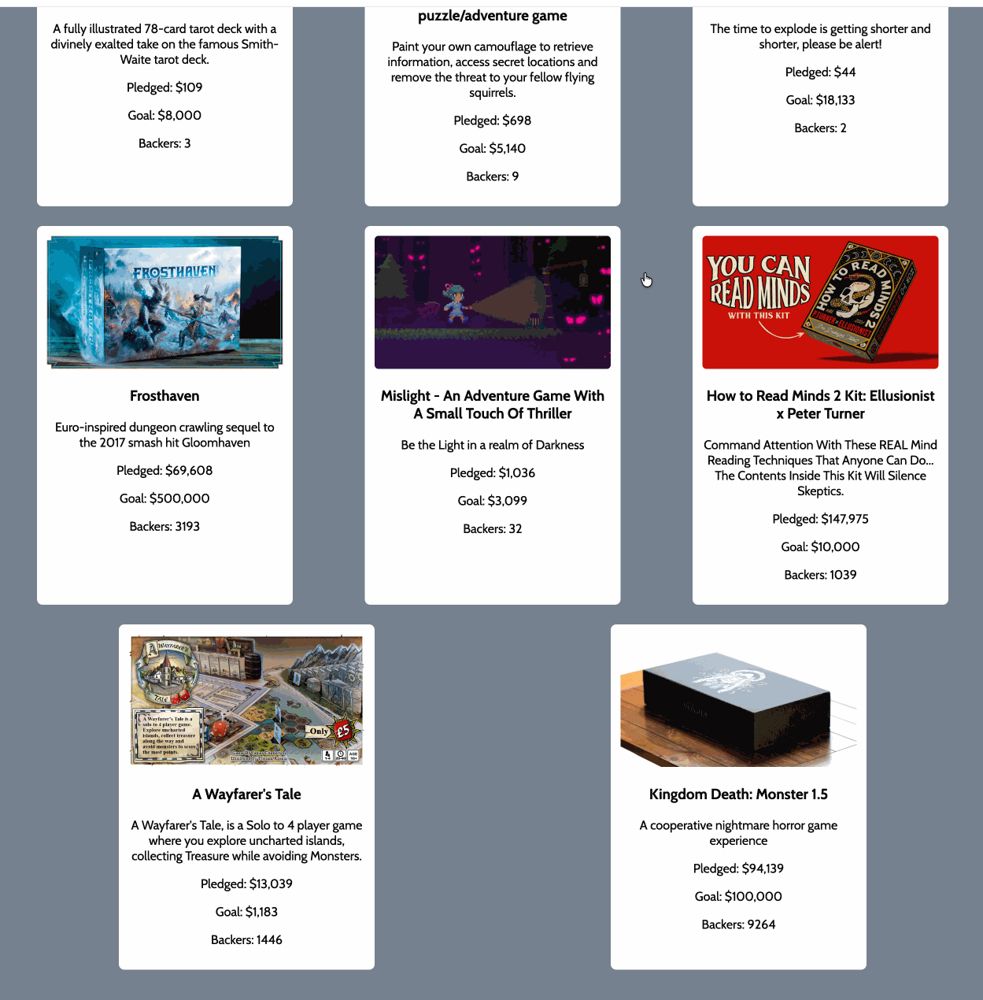

# Sea Monster Crowdfunding Dashboard

Submitted by: **Rigong Te**

Sea Monster Crowdfunding Dashboard is a web page that displays information about games funded by the Sea Monster Crowdfunding company. The app shows company stats, a list of games, and buttons that filter the displayed games by funding status.

Time spent: **3 hours**

## Required Features

The following required functionality is completed:

* [x] The introduction section explains the company background and how many games remain unfunded.
* [x] The Stats section displays the total number of contributions, total amount raised, and total number of games.
* [x] The Our Games section initially displays all games funded by Sea Monster Crowdfunding.
* [x] The Our Games section includes buttons to show only unfunded games, only funded games, or all games.

## Optional Features

The following optional improvements can be added:

* [ ] Display a running total of unfunded vs funded games.
* [ ] Improve card styling and hover effects for better visual polish.
* [ ] Add a video walkthrough or animated demo GIF.

## Video Walkthrough

Here's a walkthrough of the app in action:

## How to Run

1. Open `index.html` in a browser.
2. The page loads game data from `games.js` using JavaScript.
3. Use the filter buttons to switch between unfunded games, funded games, and all games.

## Notes

* The app uses `reduce()` to calculate totals such as total contributions and total pledged amount.
* Game cards are created dynamically and appended to `#games-container`.
* `deleteChildElements()` clears the current game cards before adding filtered results.

## License

Copyright 2026 [Your Name]

Licensed under the Apache License, Version 2.0 (the "License"); you may not use this file except in compliance with the License. You may obtain a copy of the License at

    http://www.apache.org/licenses/LICENSE-2.0

Unless required by applicable law or agreed to in writing, software distributed under the License is distributed on an "AS IS" BASIS, WITHOUT WARRANTIES OR CONDITIONS OF ANY KIND, either express or implied. See the License for the specific language governing permissions and limitations under the License.
